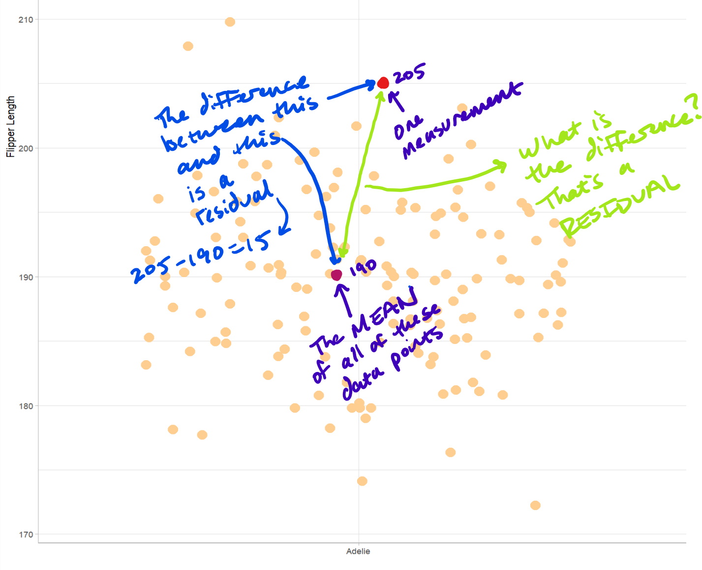
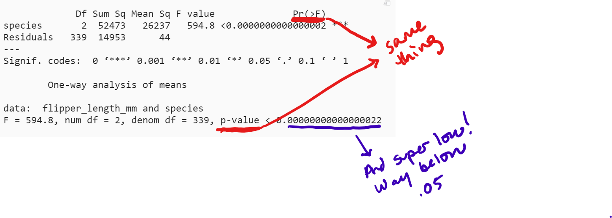

```{r, include=FALSE}
knitr::opts_chunk$set(
  out.width = "100%",
  message=FALSE,
  warning=FALSE
)
```

```{r}
library(pacman)
p_load(tidyverse, skimr, scales, rmarkdown, magrittr, lubridate, janitor, ggrepel, ggthemes, showtext, knitr, reactable, palmerpenguins, car, broom, ggpubr, readxl, stringr, viridis, gghighlight, outliers, lattice)
```

# THE STAR OF THE SHOW: ANOVA

Statistical tests are useful tools for confirming or disproving hunches. You have a hypothesis and you use a statistical test to see if that hypothesis is bang on or bunk. One test that is useful for comparing between groups is the ANOVA test. ANOVA answers this one simple question:

## ARE THEY REALLY DIFFERENT?

In this tutorial, we will be looking at WHEN to use the ANOVA test and HOW to use the ANOVA test.

First, the WHEN.

**Criteria:**

-   You have multiple categories of something. As we will see below, that could be species, ages, divisions...the point is that you need multiple categorical variables that you can compare.

-   You have numbers for each category, and those numbers all communicate the same variable. You have measured the same thing across the categories. You measured wing size, on-base percentage, or quarterback ratings. You measured something and now have a number for the thing. And you measured that value for each of the categories. You measured all of the penguins, or all of the baseball or football players and derived a number for this variable.

-   You have a lot of values per category. You measured 150 31-year olds, or 5000 penguins, or looked at 90 quarterbacks for each division. It is not impossible to do ANOVA with small "sample sizes" but it is easier the more measurements you have for each category.

When trying to understand ANOVA, it is good to think in box plots. If there is one or two (or more) box plots that don't seem to cover the same area, I suspect that that group is a little different than the rest.

To a 5th grader I would say: Do those boxes look the same or different? Is one box higher than the others?

```{r}
pendat <- penguins %>% select(species, flipper_length_mm)

pendat %>% 
  ggplot(aes(species, flipper_length_mm, color = species)) +
  geom_boxplot(show.legend = FALSE) +
  theme_light() +
  scale_color_viridis(discrete = TRUE, option = "magma", begin = .9, end = .4)+
  labs(x = "", y = "")+
  theme_classic()+
  theme(axis.text = element_blank())
```

Even if one box looks "higher" than the others, that doesn't mean that it is significantly so. That could have been chance. It could have been complete coincidence that when you were taking the measurements for purple (in the box plot above) that they ate their Wheaties that morning and they were performing abnormally well...but on average, they are about the same as yellow. The yellow, red, and purple boxes might actually be roughly the same, or (what ANOVA is really testing) they might have the same mean. ANOVA helps us determine if there really is a difference or if this was just a fluke, a Wheaties in the morning aberration.

So that is WHEN to use it: comparing categories on the same variable when you have a lot of data points for each. There are some other criteria we will get to along the way, but these are the first three hurdles to jump - do you have a category, do you have numbers, and do you have a lot of numbers?

And remember, ANOVA is always answering the question: ARE THESE REALLY DIFFERENT?

Now we have to get to HOW to use it. As with everything else, life becomes rather easy with R.

(I am going to try to keep this rather simple. If you want a more detailed explanation of everything, [I suggest checking out this site](https://statsandr.com/blog/anova-in-r/#aim-and-hypotheses-of-anova). This is where I learned most of this stuff. We are going to go over the example that the guy gives on this site, but then we are going to branch out and do a couple of examples on our own.)

# "HOW TO" WITH EXAMPLE

The first example we will look at to help us practice doing an ANOVA test will use the Palmer Penguins data set, which comes with R. I already loaded it at the beginning, so load it up if you have not done so already.

Let's get a look at the data and then isolate the variables we are going to be looking at in particular.

```{r Look at Palmer Penguins}

head(penguins)

pendat <- penguins %>% select(species, flipper_length_mm) %>% drop_na()

summary(pendat)
```

After getting a quick look at the data, we have to ask ourselves if we can even run an ANOVA test with what we have.

1.  Do we have categories we can compare?

-   Yep. We have different types of species - three to be exact. Perfect for ANOVA.

2.  Do we have numeric (quantitative) variables that measure the same thing for each category?

-   Yep. Flipper lengths are measured in millimeters for each species.

3.  Do we have a lot of values for each category?

-   "Well, what is a lot?" You are right, I never gave a number or threshold for what constitutes "a lot." The rule of thumb is more than 30. So, do we have more than 30 measurements for each category or species? Yep. Chinstrap only has 68 but we are still well above 30 so we are good.

We met the criteria, we can run an ANOVA test. Before we run the test though, it is a good idea to get a look at the data in a graph to see if anything is fishy. We might be able to guess what the test might say even before we run it just by looking at the data. Here are two ways to get a good look: a dot plot and a box plot. One of these might look a little familiar.

```{r Visualize Palmer Penguins}

pendat %>% 
  ggplot(aes(species, flipper_length_mm, color = species)) +
  geom_jitter(show.legend = FALSE, size = 1.5) +
  theme_light() +
  labs(x= "Species", y = "Flipper Length")+
  scale_color_viridis(discrete = TRUE, option = "magma", begin = .9, end = .4)

pendat %>% 
  ggplot(aes(species, flipper_length_mm, color = species)) +
  geom_boxplot(show.legend = FALSE) +
  theme_light() +
  labs(x= "Species", y = "Flipper Length")+
  scale_color_viridis(discrete = TRUE, option = "magma", begin = .9, end = .4)
```

Just by looking at the data in this way we can guess that Gentoo are very different from Adelie. Our guess, before we even get started, would be that on average, Gentoo have longer flippers than Adelie.

But again, it could be that the Gentoo who were measured were abnormal, or that they were roiding pretty hard, and that normally, Gentoo have the same flipper length as Adelie. ANOVA will help us determine if that is the case.

So, now we run the ANOVA test, right? Not quite yet. We have to test a couple of things first.

First, we have to see if the samples are "normal" - meaning do they follow roughly a normal distribution. We can do this by looking at the residuals for the entire group and see if they follow a bell curve (residuals are the difference from the actual measurement and the mean). That is a little "mathy." Again, *trying* to keep this simple....



We calculate all the residuals (R does this for us), and then see if they follow a bell curve. Here is how you can see if the residuals (actual measurement minus the mean of the entire sample) are normal:

```{r}

pendat_anova <- aov(flipper_length_mm ~ species, data = pendat) 
# We actually skip to the end and perform the ANOVA test, but just to get the residuals!

pendat_res <- as.data.frame(pendat_anova$residuals)
# Have to turn it into a dataframe to pipe it into a ggplot. You could also just do histogram(pendat_anova$residuals) but let's stay consistent and use ggplot. If you take a look at these residuals, some are negative. That is because some measurements are below the mean. You still do the measurement minus the mean, which will return a negative number. 

head(pendat_res)

pendat_res %>% 
  ggplot(aes(`pendat_anova$residuals`)) +
  geom_histogram()
```

Lucky us, that looks pretty normal (bell curvish). There is a way to test for normality in a more "formal" way too, with the Shapiro-Wilk test. R, of course, has an inbuilt function for this.

```{r Shapiro-Wilk Test}

shapiro.test(pendat_anova$residuals)
```

The Shapiro-Wilk test is pretty easy to interpret in this case. If the p-value is over .05 it means we passed the normality test. We are at .26 so we passed. Moving on!

...kind of. In all reality, because all three groups have over 30 measurements, we don't even have to test for normality! From the website I linked earlier...

> In case of large samples, **normality is not required** (this is a common misconception!). By the [central limit theorem](https://en.wikipedia.org/wiki/Central_limit_theorem), sample means of large samples are often well-approximated by a normal distribution even if the data are not normally distributed ([Stevens 2013](https://statsandr.com/blog/anova-in-r/#ref-stevens2013intermediate)).^[3](https://statsandr.com/blog/anova-in-r/#fn3)^ It is therefore not required to test the normality assumption when the number of observations in each group/sample is large (usually n≥30).

I showed you how to test for normality just in case you might need it (you run into some small samples, let's say), but for each of the examples we are going to go through here, all of our sample sizes are over 30 so we don't really need to test for it.

Now we test to see if the categories have equal variances. The fancy word for this is homogeneity. Box plots again help us out. We ask "Are the length of the boxes and 'whiskers' roughly the same for each of the categories?"

```{r}
# Check equality of variances - homogeneity
pendat %>% 
  ggplot(aes(species, flipper_length_mm, color = species)) +
  geom_boxplot(show.legend = FALSE) +
  theme_light() +
  labs(x= "Species", y = "Flipper Length")+
  scale_color_viridis(discrete = TRUE, option = "magma", begin = .9, end = .4)
```

Do the boxes and whiskers have comparable sizes for all species? Yeah. Just by the eye-test there is an equality of variances. In other words, there is a similar dispersion across variables.

As with testing for normality, there is a more formal test for equality of variances: Levene's test. R to the rescue...

```{r Levene Test}

leveneTest(flipper_length_mm ~ species, 
           data = pendat)

# For data that passes the normality test, it might be a little better to use Bartlett's test. 
bartlett.test(pendat$flipper_length_mm, pendat$species)
```

As with the Shapiro-Wilk test, this one is easy to interpret for our purposes. If the p-value is above .05 there is an equality of variance. In this case, we have a p-value for both tests which is well above .05. We passed the equality of variance test. Moving on!

Are there any outliers in the data? We can do this by sight and just determine if any data points seem like they would skew our results. In the box plots above, there are some some points outside the "whiskers" of the box plot for Adelie, but they are not outrageously so, so we could probably move on. There is a formal test for outliers that we will get to in a second.

(Don't worry, we will see what happens if we fail one, or two, or all of these tests below.)

FINALLY we can perform our ANOVA test. Remember, the ANOVA test answers the question: "Are they really different?" Are the differences in flipper length between the penguin species real? Are they significantly different? Here is how to do an ANOVA test in R:

```{r ANOVA test}
#To do an ANOVA put aov() in a summary()
pendat_aov <- aov(flipper_length_mm ~ species, data = pendat)

summary(pendat_aov)

# or...
oneway.test(flipper_length_mm ~ species, 
            data = pendat,
            var.equal = TRUE)
# This is one way to do the test if you failed the equality of variances test. Just put "var.equal = FALSE" if the variances between the groups are not equal. 
```

Look at both of these results. They are saying the same thing. The p-value again is what we are interested in.



The p-value is well below .05, which means there really is a difference between the groups. If it was above .05 we could say, "Ehh, no difference really." But this makes it really clear, "Whoa, there is a difference in flipper length for at least one of the groups here."

But we don't really know which group(s) is (are) different. To see which groups are different, we need the Tukey test.

```{r Tukey Test}

TukeyHSD(pendat_aov)
```

Per usual, we take a look at that p-value (this time labeled "p adj"). Zeros. For each one. If the p-value is below .05 then we say "something is going on here." In this case, each of these groups is significantly different from each other. We can also simplify this by visualizing it.

```{r}
plot(TukeyHSD(pendat_aov))
```

The plot is all over the place; there is no overlap and they aren't even close to each other. That means all are different from each other.

That is ANOVA in action. ANOVA just answered the question for us "Are they really different?" Yes. Yes they are.

# On Our Own

### Baseball Exit Velos and Barrel Rates

What we have done so far was pretty much following along at the website I keep referencing (hey, it's a good site that explains ANOVA; just giving it some props). Now we are going to follow the same procedures with some of our own data. I always default to sports so let's look at some baseball stuff and then look at some football stuff.

First, baseball. Let's try this for baseball age groups (categorical) and exit velocity (quantitative), then barrels (quantitative). Exit velocity measures how fast the ball is coming off the bat once the ball is hit. Barrels is the percentage of time the hitter hits the ball on the fat part of the bat. Do older players generate less power? Do younger players hit the ball "fatter" than older players? Let's find out.

I downloaded the data at Baseball Savant. [Here is the link to the page](https://baseballsavant.mlb.com/leaderboard/custom?year=2021,2020,2019,2018,2017&type=batter&filter=&sort=1&sortDir=desc&min=50&selections=player_age,exit_velocity_avg,barrel_batted_rate,&chart=false&x=player_age&y=player_age&r=no&chartType=beeswarm) where I got the data. We are looking at data just from the past five years. We are only taking a look at age, EV (exit velocity), and Barrel %.

```{r Download Baseball Data}

baseball_anova <- read_csv("C:\\Users\\andre\\Downloads\\baseballstats.csv")
```

Let's clean this up a little. Also, let's add player age range categories:

-   20-24

-   25-29

-   30-34

-   35+

Each player will fall in one of these categories and those will be the categories we compare.

```{r Clean data}
baseball_anova <- baseball_anova %>% dplyr::select(-12) %>% clean_names() %>% 
  mutate(age_group = ifelse(player_age >= 20 & player_age < 25, 
                            "20-24", 
                            ifelse(player_age >= 25 & player_age < 30,
                                   "25-29", 
                                   ifelse(player_age >= 30 & player_age < 35, "30-34", "35+")))) %>% 
  # Use this to group player age ranges
  mutate(age_group = as.factor(age_group)) %>% 
  mutate(player_name = paste0(last_name, ", ", first_name)) %>% 
  dplyr::select(player_name, player_id:age_group)
```

And let's take a look at the counts for each age, and age group.

```{r How many players per age}

baseball_anova %>% 
  count(player_age)

baseball_anova %>% count(age_group)
```

We have plenty of observations for each age group so we don't have to worry about the test for normality moving forward.

We want to see if exit velocity is different by age of the player. We will try to answer the question: Are exit velocities really different by age? Let's go through our steps from the penguin data above. The first step is to just look at it visually and see if there is anything that is screaming for attention.

```{r}
# Dot Plot
baseball_anova %>% ggplot(aes(age_group, exit_velocity_avg, color = age_group)) +
  geom_jitter(show.legend = FALSE) +
  theme_light() +
  labs(x= "Age Group", y = "Average Exit Velo")+
  scale_color_viridis(discrete = TRUE, option = "magma", begin = .9, end = .4)

# Box Plot
baseball_anova %>% 
  ggplot(aes(age_group, exit_velocity_avg, color = age_group)) +
  geom_boxplot(show.legend = FALSE) +
  theme_light() +
  labs(x= "Age Group", y = "Average Exit Velo") +
  scale_color_viridis(discrete = TRUE, option = "magma", begin = .9, end = .4)
```

There don't seem to be any big differences in the mean. The older players might hit the ball a little harder than the 23 year old...but on first glance there doesn't seem to be much difference in exit velocity by age. The 35+ data is a little spread out, so we might run into some problems with equality of variance in a second.

There are some potential outliers we need to look at. If there is an outlier that is way out of range, we should probably check it out. Here is a test to detect outliers.

```{r warning=FALSE}
grubbs.test(baseball_anova$exit_velocity_avg)
```

The p-value is way below .05 meaning we have some outliers that might need attention. Let's take a look at that 72.5 and who produced it.

```{r}
baseball_anova%>% arrange(exit_velocity_avg)
```

Ahh, that makes sense: R.A. Dickey, a pitcher, has the ignominious title of "Player with the lowest exit velo." That's not really fair. Most of the bottom feeders on this list are pitchers (except for Ender Inciarte. Swing a little harder Ender...), so let's set the lowest exit velo we will consider in the set at 80. That should weed out the pitchers (after all, it is not their job to hit the ball hard).

```{r}
exit_velo <- baseball_anova %>% filter(exit_velocity_avg > 80)

```

And we try the outlier test again.

```{r}

grubbs.test(exit_velo$exit_velocity_avg, opposite = TRUE) 
# Because we got rid of the low-end outliers, it now tests for high-end outliers. We want to show we cleared the low-end threshold which is what we were worried about, so we put opposite = TRUE here. 
```

We are good now.

Next, we don't need to test for normality because each age group has over 30 observations.

We move on to the test of equal variance. The dot plot above shows some spread out data for the 35+ group. Let's check equality of variance formally:

```{r Check for equality of variance}

leveneTest(exit_velocity_avg ~ age_group, data = exit_velo)

# Bartlett's test is another test for equality of variance and might work better for normal groups. 
bartlett.test(exit_velo$exit_velocity_avg, exit_velo$age_group)
```

Levene's and Bartlett's test says the variances are not equal enough. That is ok. We can still run the ANOVA test, we just have to use the oneway.test() and signify the variance are not equal.

Remember our question: is there a significant difference in exit velocities between different ages of players? (I have a hunch it is going to say "Nope.")

```{r ANOVA Exit Velo}

oneway.test(exit_velocity_avg ~ age_group, 
            data = exit_velo,
            var.equal = FALSE)

# Have to use this test because the variances are not equal according to the test. 
```

The p-value is well above .05. Then we do NOT have a significant difference in exit velos between groups.

<br>

<br>

How about barrel rates though? Does an older player make significantly worse contact than a younger player?

This time, we are going to try to filter out some of the pitchers ahead of time by getting rid of all of the 0% barrel rates.

We follow our steps. #1: Get a look at the data visually.

```{r}
barrel <- baseball_anova %>% filter(barrel_batted_rate > 0) 

# Dot Plot
barrel %>% ggplot(aes(age_group, barrel_batted_rate, color = age_group)) +
  geom_jitter(show.legend = FALSE) +
  theme_light() +
  labs(x= "Age Group", y = "Average Barrel Rate")+
  scale_color_viridis(discrete = TRUE, option = "magma", begin = .9, end = .4)

# Box Plot
barrel %>% 
  ggplot(aes(age_group, barrel_batted_rate, color = age_group)) +
  geom_boxplot(show.legend = FALSE) +
  theme_light() +
  labs(x= "Age Group", y = "Average Barrel Rate") +
  scale_color_viridis(discrete = TRUE, option = "magma", begin = .9, end = .4)
```

Not too much of a difference in the means it seems. There are a few 30 some year olds who are squaring the ball up almost 25% of the time, which is ridiculously impressive. Just by looking at the dot and box plots here, we can tell we have some outliers that are going to impact our analysis.

```{r Barrels Outliers}

grubbs.test(barrel$barrel_batted_rate)
```

Oh yeah - a p-value well below .05 means we have some outliers in the data. What we will do is run the analysis without the outliers first, then run the analysis with the outliers and compare them.

First, let's get rid of these outliers and run Grubbs test again (which should show no problem...seing as we just jettisoned all the outliers).

```{r}
otlr <- barrel$barrel_batted_rate[barrel$barrel_batted_rate %in% boxplot.stats(barrel$barrel_batted_rate)$out]
#Got this from https://stackoverflow.com/questions/4787332/how-to-remove-outliers-from-a-dataset

barrel_noout <- barrel %>% filter(barrel_batted_rate < min(otlr))

grubbs.test(barrel_noout$barrel_batted_rate)
```

Central limit theorem zooms us past the test for normality straight on to the test for equality of variance.

```{r}
leveneTest(barrel_batted_rate ~ age_group, data = barrel_noout)

#Barlett's test is another test for equality of variance.
bartlett.test(barrel_noout$barrel_batted_rate, barrel_noout$age_group)
```

Bartlett's might be better for our purposes here (in looking at the data visually, there is some variation between the spread for each group but it doesn't seem extreme). According to both though, we have equality of variance. We can then proceed to ANOVA.

```{r}

summary(aov(barrel_batted_rate ~ age_group, data = barrel_noout))

# or...
oneway.test(barrel_batted_rate ~ age_group, 
            data = barrel_noout,
            var.equal = TRUE)
```

Both ANOVA tests say the same thing: No real difference between age groups for barrel batted rate.

Not done. Remember, we canned the outliers. What if we added them back in. Does the ANOVA test say the same thing?

For this question, I think the outliers are important (we need to include those crazy ones for the 25-29 group). There is one ANOVA test we haven't looked at yet that can handle outliers...and unequal variance...which it seems we also have.

```{r}
leveneTest(barrel_batted_rate ~ age_group, data = barrel)

bartlett.test(barrel$barrel_batted_rate, barrel$age_group)
```

If we don't have equality of variance, and we have outliers, we can use the Kruskal-Wallis ANOVA test. It calculates ANOVA a little differently than the previous tests we have used (super technical stuff I won't get into here), but it handles these issues a little better than these other tests.

Is there a difference in barrel rates by age

```{r}
kruskal.test(barrel_batted_rate ~ age_group, data = barrel)
```

The p-value is above .05 so we can say that there isn't a significant difference in barrel rates between the ages.

Let's have some fun. Let's include way more ages. We will go ages 23 through 37 (the sample size for ages below 23 and above 37 get too low). Can ANOVA handle all the categories?

```{r}
baseball_anova_age_all <- baseball_anova %>% 
  filter(player_age < 38 & player_age > 23) %>% 
  filter(exit_velocity_avg > 80) %>% 
  mutate(player_age = as.factor(player_age)) 

baseball_anova_age_all %>% count(player_age)
```

Let's get a visual of the data for exit velocity.

```{r}
# Dot Plot
baseball_anova_age_all %>% ggplot(aes(player_age, exit_velocity_avg, color = player_age)) +
  geom_jitter(show.legend = FALSE) +
  theme_light() +
  labs(x= "Age", y = "Average Exit Velocity")+
  scale_color_viridis(discrete = TRUE, option = "magma", begin = .92, end = .2)

# Box Plot
baseball_anova_age_all %>% 
  ggplot(aes(player_age, exit_velocity_avg, color = player_age)) +
  geom_boxplot(show.legend = FALSE) +
  theme_light() +
  labs(x= "Age", y = "Average Exit Velocity") +
  scale_color_viridis(discrete = TRUE, option = "magma", begin = .92, end = .2)
```

We have big sample sizes for each so we can bypass the test for normality. Let's check equality of variances.

```{r}
leveneTest(exit_velocity_avg ~ player_age, 
           data = baseball_anova_age_all)

bartlett.test(baseball_anova_age_all$exit_velocity_avg, baseball_anova_age_all$age_group)
```

Uh-oh, two different results from the two tests. Usually Bartlett's is good with lots of samples that end up being normal thanks to the central limit theorem. The age 37 group might be throwing things a little out of whack with only 33 samples.

How to rectify this? Eyeball it. Back to the dot and box plots. Do the ranges between the ages seem somewhat equal? Age 37 is a little more spread out but roughly they cover the same range. There is another test you could do - calculate each group's variance and then see if the largest is more than 4 times bigger than the other; if it is not, you should be good - but we aren't going to do that here (I did take a look and the variances are all roughly the same - none is 4 times larger than any other one). But...just because we can, let's run the ANOVA with equality of variance and without. But first...

Outliers?

```{r}
grubbs.test(baseball_anova_age_all$exit_velocity_avg)
```

Not after we got rid of the pitchers.

Can ANOVA handle all of this? And will there be a difference in exit velos between the ages?

```{r}
# With equality of variance
baseball_anova_all <- aov(exit_velocity_avg ~ player_age, data = baseball_anova_age_all)

summary(baseball_anova_all)

#And without
oneway.test(exit_velocity_avg ~ player_age, 
            data = baseball_anova_age_all,
            var.equal = FALSE)
```

Wow. With a p-value near 1 for both tests we can confidently say there isn't a lot of difference in exit velocity across the ages.

### Football QBRs by Division

I am thoroughly convinced that QBs on the west coast have it easy. In particular, I think that quarterbacks from the NFC West have higher quarterback ratings than quarterbacks from other divisions. Let's see if my hypothesis has any weight.

First, let's read in some data to work with. I got a lot of quarterback data from the last 10 years on [Pro-Football Reference](https://www.pro-football-reference.com/years/2021/passing.htm) and put it all into one spreadsheet. I only included quarterbacks that had a minimum of 10 pass attempts for the season.

```{r}
qbr <- read_excel("C:\\Users\\andre\\OneDrive\\Desktop\\Github\\andrewborozanprojects\\andrewborozanprojects\\Data\\QB_2011.xlsx")
```

We will clean up the column names and then select the columns we want to look at. We also want to get rid of quarterbacks who were traded mid season. There are only a couple but since we are not provided which teams they played for (and which stats belong to which team) we just jettison them.

```{r}
qbr <- qbr %>% clean_names() %>% select(player, tm, qbr)

qbr <- qbr %>% filter(tm != "2TM", 
                      tm != "3TM") %>% 
  drop_na(qbr)
```

The next step is tedious. The data set doesn't have the division each team is in, so we have to attach that to the table we just created.

```{r}
afce <- c("BUF", "NWE", "MIA", "NYJ")
afcn <- c("PIT", "CLE", "BAL", "CIN")
afcs <- c("TEN", "HOU", "IND", "JAX")
afcw <- c("DEN", "KAN", "LAC", "OAK", "LVR", "SDG")
nfce <- c("DAL", "WAS", "NYG", "PHI")
nfcn <- c("CHI", "GNB", "MIN", "DET")
nfcs <- c("ATL", "TAM", "NOR", "CAR")
nfcw <- c("SEA", "SFO", "ARI", "LAR", "STL")


qbr$div <- with(qbr,
                ifelse(tm %in% afce, "AFCE",
                ifelse(tm %in% afcn, "AFCN",
                ifelse(tm %in% afcs, "AFCS", 
                ifelse(tm %in% afcw, "AFCW",
                       ifelse(tm %in% nfce, "NFCE",
                              ifelse(tm %in% nfcn, "NFCN",
                                     ifelse(tm %in% nfcs, "NFCS", "NFCW"
                                            ))))))))
qbr <- qbr %>% 
  mutate(div = as.factor(div))

```

ANOVA time. Remember, we are trying to see if there is a significant difference in quarterback ratings (qbr) between divisions (e.g. AFCE, AFCN, NFCS...).

Follow our steps from above. First, look at the data visually.

```{r}
# Dot Plot
qbr %>% ggplot(aes(div, qbr, color = div)) +
  geom_jitter(show.legend = FALSE) +
  theme_light() +
  labs(x= "Division", y = "QBR")+
  scale_color_viridis(discrete = TRUE, option = "magma", end = .95, begin = .3)

# Box Plot
qbr %>% 
  ggplot(aes(div, qbr, color = div)) +
  geom_boxplot(show.legend = FALSE) +
  theme_light() +
  labs(x= "Division", y = "QBR")+
  scale_color_viridis(discrete = TRUE, option = "magma", end = .95, begin = .3)
```

At a glance there does not seem to be any significant differences between divisions. If anything, the NFC South is a bit higher than others. Let's see if it is SIGNIFICANTLY different than the others.

Do we pass the normality test? Let's see if we have over 30 for each group.

```{r}
qbr %>% 
  count(div)
```

Oh yeah, we are fine. All well over 30 so we move on to a test for the equality of variance. Based on the box plots above we seem to be ok. Let's formally test with Levene's test.

```{r}
leveneTest(qbr ~ div, 
           data = qbr)

bartlett.test(qbr$qbr, qbr$div)
```

Safe there. Variances are good. Outliers?

```{r}
grubbs.test(qbr$qbr)
```

Nope.

ANOVA time.

```{r}
qbr_anova <- aov(qbr ~ div, data = qbr)

summary(qbr_anova)
```

Woof. That p-value is getting close to .05 but not there yet. In math speak, we fail to reject the null hypothesis - meaning there is not a significant difference in the QBRs across divisions.

Even though the ANOVA test revealed there is no significant difference between groups, are there some that are closer to that .05 threshold than others? Which comparison between divisions shows one is, if not statistically at .05 significant, significant at ,10? The Tukey test can help us.

```{r}

TukeyHSD(qbr_anova)

plot(TukeyHSD(qbr_anova))
```

There is quite the difference between the AFC East and NFC South (p-value of .07). Interesting: Tom Brady's QBR couldn't make up for the parade of dopes the Jets and Dolphins were traipsing out there.

So I was wrong: The NFC West does not have significantly better quarterbacks than other divisions. If any division was close to being significantly different it was the NFC South being miles ahead of the AFC East over the past 10 years.

# The End is Near, The End is Here

This wraps up our look at the ANOVA test. We looked at one (actually two by throwing the Kruskal-Wallis test in the middle there) type of ANOVA test, when to use it, and how to use it in R. Doing this in R is like having a superpower: it does pretty much everything for you. Just plug and play.

If you need to answer the question - Are they really different? - then ANOVA is the test to use!
