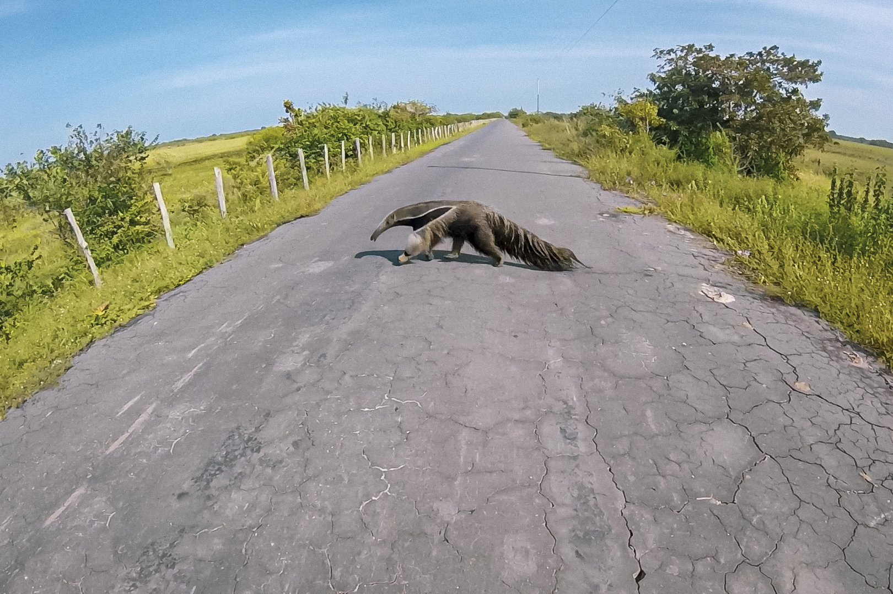

 

Thoughts are funny to think about. We have them all the time, and yet the anatomy of a thought is rarely the object of our thought...well, because...it's tricky...and kind of paradoxical, if that is the right word for it, kind of like a mirror trying to reflect itself....and because we usually have better things to think about. I can't remember where I read this (the beginning of every good anecdote) but someone was trying to dissect humor and claimed the very act of analyzing humor was a very unfunny thing. Trying to analyze thought has a similar dizzying quality about it: the very act is the object...upon which we act. Really smart people have picked and prodded this conundrum - Plato, Descartes, Daniel Dennett, and countless other people who get paid to think for a living (lucky bastards) - and I don't know if they "solved" anything in regards to what is really happening when we think about thoughts. In my own musings, to help me understand thoughts better, it seems like thoughts come in two different categories:

1)  Conscious thoughts

2)  Fly-at-you-out-of-nowhere thoughts

First, the anatomy of conscious thought. These are the controlled and directed thoughts - controlled and directed by the will of the thinker. These conscious thoughts are the objects that we typically think of when we think of "thinking." "I am thinking about something" means that a person (or animal, I suppose...not quite the time or place to get into the levels or animal consciousness) is willfully, purposefully directing their attention to definite (or maybe ill-defined but working towards definition) objects that inhabit the mind in either a spacial sense (the classic "don't think of a pink elephant" leads you to imagining an image of pink elephant) or a linguistic-audial sense (one can imagine sounds and words), or both at the same time. That was a turgid way of saying "When we think, we think about stuff" but the main point to be made here is that conscious thoughts are had because a person was willfully having them. Conscious thoughts are what we have when we study something, or, typically, when we read, or, hopefully, when we are conversing with someone.

Fly-at-you-out-of-nowhere thoughts, the second colorful category in this broad brushed painting, are those thoughts that seem to come from nowhere in particular, at least, not from within. They arrive from the ether, outside of anything that could be distinguished as our own "mind." They just happen to you. It is the song that you have stuck in your head from the moment you wake up ("Guns and Roses isn't a terrible soundtrack for the day, but where did that come from? What was I dreaming about?"). It is that thought of jumping when looking over the edge of a high cliff - you didn't think of that, it just bombarded your brain (wait...nobody else has this phenomenon happen to them? I guess I won't use my "that thought of randomly punching or kissing someone" example then...). You don't control them, they just happen.

One easily turns into the other too. Fly-at-you-out-of-nowhere thoughts frequently become conscious thoughts if followed or entertained (even if what constitutes "followed" or "entertained" is murky at best. Is it determined by duration? An intensity? Finishing the song in your head?). A flitting thought is often a caterpillar that metamorphosizes into a conscious butterfly.

Let's stick with these two categories of thought to describe the thoughts that have been either occupying my attention (conscious thought) or whizzing through my head (Fly-at-you-out-of-nowhere thought) during the past few months, as I have made the decision (a conscious thought of action) to give up the teaching profession and enter the rabbit hole of data analytics. Many of these thoughts begin as fly-bys, but are quickly caught and digested by consciousness.

One persistent gnat of a thought is the title's namesake: "Am I crazy?" Most of the time this is an external thought milling around my head that I attempt to swat away. It usually comes on the heels of a frustrating effort to learn something new ("I can't figure out how to make this chart look the way I want in Tableau"). I guess there is something about fly-at-you-out-of-nowhere thoughts; they aren't entirely out of nowhere. They can be precipitated by a condition, for instance a mood or situation. A fly sees an open window and buzzes on in for a visit. At my best, I shoo it back out the window or swat it dead. But sometimes I follow it. Sometimes the "Am I crazy?" becomes a conscious thought. At the beginning of this journey, the "Am I crazy" became the conscious thought... \n \n "I am crazy. I had it made as a teacher, an international teacher at that. I called being an international teacher "the cheat code to life"; why on earth would I give that up? I traveled the world. I mean, look at some of things I saw...

 

I made a fine living, the job was stressful and there was a lot of work, but it wasn't too bad...at least from a distance. I was well respected: my kids worshiped me, my colleagues praised me, my admin seemed to be aware of my ability to get kids excited about just about anything (I taught epistemology to 16 year olds...and they loved it). In this realm, I was confident and poised, facing any challenge with the assurance that I would be successful.

And I am trading in this kingdom for...data analytics? Something I know literally nothing about other than what I read and saw in Moneyball? Curse you Michael Lewis and Billy Beane and Brad Pitt. I don't know anything about coding, or databases, or visualization platforms. I have never heard of R, Python, or Tableau. What does SQL stand for? I have no idea. I barely know how to open Excel."

The "Am I crazy" rears its head periodically even after I learned some of that stuff, like how to manipulate data in Excel and what SQL stands for. I am nagged still by that pesky thought which crosses into the conscious at times: "I should just go back into teaching - it is so much easier and I am good at it. I can't do this stuff. I can't figure out \_\_\_\_\_\_\_\_\_ (fill in the blank with any number of things: web scraping, Python, how to make popping visualizations)...and I never will. I watch these tutorials and see these people who are brilliant at this stuff and that just isn't me. I can read SQL and R fine, but if someone gives me an objective and says "Alright, go write a script to get the information," I freeze. I am crazy for trying this..."

"Am I crazy" has a partner in crime: "I am going to fail." It is easy to see how one line of thinking leads to the next. "I am crazy for trying this...because I am going to fail in the attempt." I don't think I have the same crippling fear of failure I once had (still hanging onto my fear of sharks though), but even if I don't cower at it as I once did, I still don't want to fail. And failure is a very real possibility. I come from the land of the humanities: history major in college, masters in history and philosophy, taught both during my teaching career, the books, the podcasts, the movies I consumed, all of it miles away from the quantitative quarry of data analytics. I don't have the background, I don't have the props, and so bombing on this stage is a tangible prospect. And then what? Tell everybody I tried and failed? Had to go back to teaching because I just couldn't hack it in data. Too much math. Too much "computer stuff" that I just didn't understand. Back to teaching about Hitler and Stalin and how to write a good essay. There is a lot of shame in admitting defeat.

The fly-by "failure", if entertained in consciousness, is a little dark and dank.

But the "Am I crazy" and "I am going to fail" aren't the only fly-at-you-out-of-nowhere thoughts I have had the past few months. There are the moments when something does click, times when I make a stunning viz, or write a bit of code that makes me go "I didn't know a computer could do that," and the thought hits me: I can do this. Not only can I do this, I could be good at this. Those are the fleeting thoughts you want to hold on to, to walk with, to follow all the way down to the very bottom. They are the fly-by thoughts that turn into these conscious gems:

"I have a lot of learning to do, but I also need to appreciate the distance I have already traveled. I am really comfortable in R and can do things like scrape data off a website. I didn't even know what web scraping was a mere five months ago, and now I can write a program that can jump page to page and pull data. And I can put that data into a data frame that I can analyze and put into a visualization. How cool is that? I can do some rudimentary sentiment analysis. I can make tables and plots that look like they could have been on fivethirtyeight. I can do some really cool things in Excel like run Monte Carlo simulations, problem-solver analysis, and linear regression analysis. I can do all of that. And if I can do that in a narrow window of time, think of what I can do with more exposure, more reps, more time. I always told my students that they can learn anything if they just work hard enough. Work ethic is the only thing that matters - that is what I constantly preached. Look at me live it. I am working hard and learning how to live in an entirely different one that I lived in for the first 36 years of my life.

Good job."

Much more pleasant conscious dwellings.

The thing about thoughts is that they kind of dictate one's perception of reality - perception being the operative word here. It is not that thinking certain thoughts changes objective reality, no matter how many books Eckhart Tolle and other spiritual gurus write suggesting otherwise. I can't simply think that I am rich and famous and have 2 billion Twitter followers and it is reality. It is more along these lines: general dispositions and foundational ethical beliefs guide behavior. My belief in the benefits of hard work, passed down from me by my parents, and from their parents, leads to a reality in which I work hard. The trite saying, "Those who believe they can and those who believe they can't are both right," while eye-rollingly corny on a cat poster hanging in someone's cubicle, is kind of profound in a way: thoughts matter. Thoughts influence perception and perception influences how we interact with reality. Not all thoughts find their derivation in the recess of our mind; some are those fly-at-you-out-of-nowhere thoughts that don't have much bearing on defining the core of who we are. But those conscious thoughts, those thoughts that captivate our attention, those are the thoughts that shape both reality and identity.

The great thing is that if we notice our thoughts a little more, identifying the fly-bys and the conscious thoughts, we can be more intentional in picking and choosing which thoughts we want to influence us. Being selective in our thoughts changes how we see and live in the world.

I have had a lot of thoughts over the past few months. Some fly-by, many conscious. Some dreary, others celebratory. A wide gamut of "I am making a terrible mistake" to "I am going to be the best analyst in the world." In thinking about my thoughts though, I have to keep this one thought in mind: lead the positive ones into conscious thought. Focus on the thoughts that reaffirm an uplifting and determined attitude. That is the only way I am going to have a successful switch.

Am I crazy? Yeah, but I also think I can do this.

 

 

(I really did see some really cool stuff traveling the world. It helps to have a nice camera to capture some if it. Here are some more pictures of my travels and a snapshot into the life of an international school teacher.)

