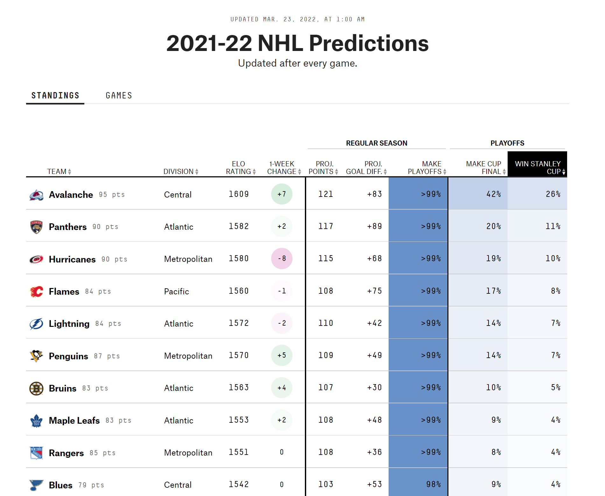
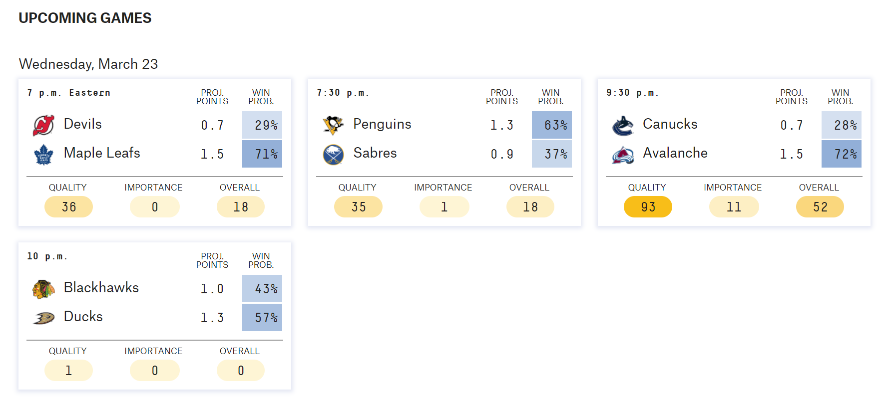

```{r, include=FALSE}
knitr::opts_chunk$set(
  out.width = "100%",
  message=FALSE,
  warning=FALSE
)

```

```{r}
library(pacman)
p_load(tidyverse, skimr, scales, rmarkdown, magrittr, lubridate, janitor, ggrepel, ggthemes, showtext, knitr, reactable, palmerpenguins, car, broom, ggpubr, readxl, stringr, viridis, gghighlight)
```

# How Good are Elo Ratings on FiveThirtyEight?

[Fivethirtyeight.com](https://fivethirtyeight.com/) is known for its stats heavy sports, politics, and societal analysis. Avid sports fans might be familiar with Fivethirtyeight's Elo ratings for each of major sports leagues and college athletics. Using the Elo rating model (originally used in chess), 538 (the numeric is so much easier to type) rates teams in their respective sport and then uses the ratings to predict the outcomes of games, series, and even entire seasons.

Here is a snapshot of what these Elo ratings look like and how they are employed on 538:



And then the Elo ratings are used to derive a win probability for each team and predict a winner for each game.



Elo ratings have a lot of different factors that go into them. At its most basic, the Elo rating is derived by looking at head to head matches between teams for the entire season and looking at the point differential of the final score. If the St. Louis Blues beat the Colorado Avalanche 3-1 the Blues will experience an increase in their Elo rating and the Avs will experience a decrease. Other things are factored in, including home field/ice/court advantage, distance traveled and, in some versions of Elo ratings, even injury status of players.

I stumbled across the project on Pat Schloss's YouTube channel. He analyzed baseball Elo ratings and their effectiveness at predicting the winner of each game. I follow along with him for a while and then apply the same analysis to the NHL Elo ratings and NFL Elo ratings. (I don't touch the NBA Elo ratings for two reasons: 1) They were not easily accessible in the FiveThirtyEight Github repository, and 2) I don't give two craps about the NBA.)

## How good are Elo ratings for Baseball?

The first thing we have to do, and this sounds a little nuts, is to read in all game data in MLB history. Baseball began in 1871. That's a lot of games.

We load in the data and then look at what we just loaded.

```{r}
mlb_data <- read_csv("https://projects.fivethirtyeight.com/mlb-api/mlb_elo.csv")

str(mlb_data)
```

I am looking at this data during spring training, but if I were looking at it in-season, I would want to filter for games that have already been played. So, we will do that by default in case we run this mid-season.

```{r}
# Get only games that have already been played
mlb_data <- mlb_data %>% filter(date < Sys.Date())
```

This is where things are going to get a little complicated: for each game, we need to find who the favorite was and whether they won. I will comment through the code to explain what is happening throughout.

```{r}
# Who was the favorite for each game and did that team win?
favorite_win_prob_mlb <- 
  mlb_data %>% 
  mutate(fav_538_won = ifelse(elo_prob1 > elo_prob2,
                              score1 > score2, 
                              score2 > score1),
         # Creates a TRUE/FALSE column to see if the favorite won. If the favorite won, the value will be TRUE. IF the favorite lost, the value will be FALSE. 
         fav_538_prob = ifelse(elo_prob1 > elo_prob2, 
                               elo_prob1,
                               elo_prob2), 
         # Creates a column that has the probability of the favorite
         favorite = ifelse(elo_prob1 > elo_prob2, 
                           team1,
                           team2)) %>% 
  # Creates a column that identifies the favorite. Pat didn't have this but I found it helpful to identify. 
  select(season, date, team1, team2, favorite, fav_538_prob, fav_538_won)
# In the last step we select only the columns we are interested in. 

head(favorite_win_prob_mlb)
```

The best way to understand what is going is to look at the data visually. We will create a line plot to see how the 538 Elo model has performed since 1871. We want a line that denotes the mean for all time, so we will create that first. The mean here is the fraction of time the favorite won the game, or stated alternatively, the fraction of times the model predicted the winner correctly. The mean line shows that the model has done better than average (50%): It predicts the winner correctly 57.48% of the time.

```{r}
# We want a line in our plot to show the average win probability of favorites for all time so we are going to get that value with this...
overall_win_prob_mlb <- mean(favorite_win_prob_mlb$fav_538_won)

# Plot the fraction of games the favorite has won over time
favorite_win_prob_mlb %>% group_by(season) %>% 
  summarize(fraction_fav_won = mean(fav_538_won)) %>% 
  ggplot(aes(season, fraction_fav_won)) +
  geom_hline(aes(yintercept = overall_win_prob_mlb), color = "red") +
  geom_line(show.legend = FALSE) +
  theme_classic()+
  coord_cartesian(ylim = c(0, 1))+
  labs(x ="Season", y = "Fraction of games favorite won", 
       title = "The 538 model does a better than average job at predicting MLB games", 
       subtitle = paste0("Since 1871, the favorite has won ", 
                         round(overall_win_prob_mlb*100, digits = 2), 
                         "% of their games"))
```

What we want to do is plot the observed vs. expected fraction of games won by the favorite. In other words, for all the times the favorite had a 61% win probability, how many times did they actually win? 61% percent? Lower? Higher? We are going to group each win percentage (all the 51%s, all the 78%s....), see how many times this was predicted, then see how many times the favorite actually win when they had this particular win percentage.

```{r}
all_predicted_observed_mlb <- 
  favorite_win_prob_mlb %>% 
  mutate(fav_538_prob = round(fav_538_prob, digits = 2)) %>% #This makes grouping by the win probability possible. It would be impossible if we had the win probabilities at .63423294. We can group if they are at .63 though. 
  group_by(fav_538_prob) %>% 
  summarize(games = n(), # Counts how many times this win probability for the favorite happened. 
            wins = sum(fav_538_won), # Counts how many times the favorite won
            observed = wins/games) # Gives the percentage of time predicted favorite won. 

# You make a games played (trials) so you can use it in the binomial distribution later. You make wins and observed so you can plot them in relation to what it should be according to binomial distribution.

# Take a look at what this produces. 
head(all_predicted_observed_mlb)
```

A little analysis of this output:

-   The win probability of the favorite is in the left most columns. Think of these as "bins", almost like in a histogram.

-   The next column has how many times that win probability was given to the winner. For example, there have been 18,802 games when the favorite has had the win probability of 54%.

-   Next, we have how many times the favorite actually won those games. For the 18,802 games that were played where the favorite had a 54% chance of winning, they won 10,165 of those games.

-   The last column is simply the proportion of games won. 54.1% of the time the team who had the win probability of 54% won the game...which is exactly what you would expect. That means the model did a pretty good job in this particular case.

Finally, we want a visual representation for how well the observed win percentage by win probability fits the predictions. We will make a scatter plot that plots the win probability of the favorite (for example, .54, .55, .56...) on the x-axis and the ratio of actual wins by the favorite with that win probability on the y-axis (to continue the example from above, we would plot 10,165/18,802, or .541, on the y-axis). If the model is really good, we will see a pretty straight line of points going trending upwards from left to right.

To add further insight on whether the model was accurate, we want to see a 95% confidence interval ribbon on the graph as well. In the most simple terms, the ribbon will tell us if the model was decent: if the points lie in the shaded area, the model did a good job affixing a win probability to the favorite: the model said the favorite would win 59% of the time and the favorite won around 59% of the time. If many of the points lie outside of the shaded area, the model needs tweaking. The solid line shows what a perfect model would look like. For a brief explanation of the binomial distribution and confidence intervals see the footnote.[^1]

[^1]: In the code chunk below the footnote we use the binomial distribution to determine a 95% confidence interval for each win probability.

    The binomial test used takes the number of successes (in our case, *wins*), the number of trials (in our case, *games*), and the probability of success (in our case, *win probability*). It then calculates the odds of getting that many successes in that many trials based on the probability of success.

    For example: What is the probability of winning 65 games out of 100 when the win probability is 51%? You use the binomial test to determine the probability of winning 65 games in 100 when the win probability is 51%.

    binom.test(x = 65, n = 100, p = .51)

    This will return a p-value of .005. That means there is a .5% chance of winning 65 games out of 100 - very low.

    Ok, so what win probability would I need to get 65 wins out of 100? 51% is way too low to be confident that I would get 65 wins out of 100. I need some sort of win probability range where 65 wins out of a 100 is very possible.

    That range is the confidence interval. The confidence interval (provided when we run the binom.test) tells us that most of the time (95% of the time) 65 wins out of a 100 usually comes with a win probability of between 54% and 74%.

    Stated another way, to get 65 wins out of a 100 you would need between a 54% and 74% win probability.

    That is actually a pretty wide range. The more trials you run, the more precise this gets. Watch if we increase this example by a factor of 10.

    binom.test(x = 650, n = 1000, p = .51)

    The 95% confidence interval - the range where you are going to get most of the times you win 650 times - narrows to .619 - .679.

    This is important for our case here, seeing as there are many, many games, especially for the win probabilities from .50 to about .71. For example, there are close to 20,500 games where the favorite had a win probability of .51. Once we start getting to where the favorite had a win probability of .72, we dip below a 1000 games. We only have 9 games in the history of major league baseball where the favorite had a win probability of .82. On the graph then, you will see the gray confidence interval ribbon go berserk. With that few trials, the range of the win probability you would need to confidently get 8 wins in 10 is very wide. It is not too out of the realm of possibility that the team with a 30% of winning wins 8 out of 10. It is far more likely they win 8 out of 10 than 800 out of 1000.

    In sum, we use the binom.test() function to calculate the 95% confidence interval for each win probability. This 95% confidence interval says "95% of the time, you are going to hit your win probability between this number \_\_\_ and this number \_\_\_." Looking at our results, 95% of the time a .52 win probability hits between .513 and .527.

    Therefore, any "observed" win probability - actual proportion of games won to games played - that lies outside of the 95% interval is very unlikely to happen. That doesn't mean the game itself is wrong, it means the model did not predict the win probability of the favorite very well.

```{r}
# We want to see the 95% confidence interval in the wins

binomial_fit_validation_mlb <- 
  all_predicted_observed_mlb %>% 
  mutate(prob = fav_538_prob) %>% 
  # Need to put prob in the nested tibbled rows
  group_by(fav_538_prob) %>% 
  nest() %>% # This puts each row in its own tibble
  mutate(binomial = map(data, function(df) # map() takes the nested data and runs it through the function we are about to invoke
    tidy(binom.test(x = as.integer(df$games * df$prob), 
                    n = df$games, 
                    p = df$prob)
               ) # We are peforming a binomial test on each row of the data, meaning each win probability - .51, .52... - to determine the 95% confidence interval for each win probability. Tidy() puts our statistical findings - like the p-value and 95% confidence interval - into a tibble. 
            )
         ) %>% 
  unnest() %>% #unnest gets all of the data out of the tibble and puts it into each row.
select(fav_538_prob, games, wins, observed, conf.low, conf.high)
# We don't need all of the information from the binom.test - like parameter and statistic - so we just choose the ones that are pertinent. 

# Now, let's build a graph that shows the actual win percentage by favorite's win probabilities (the points on the graph). Again, the points will show the percentage of times the favorite with a particular win probability (say, .65) actually won. 
# The solid line shows a perfect model - the model predicted the favorite .61 of the time and they actually won 61% of the time. 
# The shaded region shows the 95% confidence interval. The model is pretty good if the points are within that shaded region.

binomial_fit_validation_mlb %>% 
  ggplot(aes(fav_538_prob, observed)) +
  geom_ribbon(aes(ymin = conf.low, ymax = conf.high), fill = "indianred1", alpha = .5)+
  geom_abline(aes(intercept= 0, slope=1), color = "indianred3", show.legend = FALSE) +
  geom_point() +
  theme_light()+
  coord_cartesian(ylim = c(0,1)) +
  labs(x = "The favorite's win probability before game was played", 
       y = "Proportion of games the favorite won", 
       title = "How well does FiveThirtyEight's Elo ratings do at predicting MLB games?")
```

The goal is for the point (dot) to be right on the line. That means that the model predicts the outcome perfectly. If you predicted the favorite to have a win probability of .67 and they win 67% of the time that means you are spot on in your prediction. Points above the line mean that you are under-predicting the win probability. You are predicting the favorite is going to win 67% of the time and they are actually winning 78% of the time. Over or under predicting significantly means your model needs tweaking. What is "significantly" here? That is what the confidence interval (the shaded region) is for. It is not too uncommon for a team to win 52% of their games when they are predicted to win 53% of the time. It is unreasonable for them to win 78% of their games when they are predicted to win 53% though. Therefore, the confidence interval is the range of acceptability. If the point is within that range, it means the prediction was reasonable.

As seen in the graph, the FiveThirtyEight Elo ratings for baseball have been historically very good. They slightly under sell the favorite most of the time, but the model demonstrates a pretty good fit to the actual data.

Can the same be said for their hockey Elo ratings? Let's find out.

## How good are Elo ratings for Hockey?

We are going to go through the same steps as above. This should move a little more quickly as we get rid of all of the explanation of what is happening in between.

Read in the data, graciously provided by FiveThirtyEight.

```{r}
nhl_data <- read_csv("https://projects.fivethirtyeight.com/nhl-api/nhl_elo.csv")
                    
```

As the season is currently in session, we filter out yet to be played games.

```{r}
nhl_data <- nhl_data %>% filter(date < Sys.Date())
```

Perform the same transformation as we did for the MLB data: create columns for the favorite win probability and identify whether the favorite won or not.

```{r}
# Who was the favorite for each game and did that team win?
favorite_win_prob_nhl <- nhl_data %>% 
  mutate(fav_538_won = ifelse(home_team_winprob > away_team_winprob,
                              home_team_score > away_team_score, 
                              away_team_score > home_team_score),
         # Creates a TRUE/FALSE column to see if the favorite won
         fav_538_prob = ifelse(home_team_winprob > away_team_winprob, 
                               home_team_winprob,
                               away_team_winprob), 
         # Creates a column that has the prob of the favorite
         favorite = ifelse(home_team_winprob > away_team_winprob, 
                           home_team_abbr,
                           away_team_abbr)) %>% 
  # Creates a column that identifies the favorite
  select(season, date, home_team, away_team, favorite, fav_538_prob, fav_538_won)
```

Let's see how the NHL Elo ratings have done over time in predicting the winner.

```{r}
# We want a line in our plot to show the average win prob of favorites for all time
# so we are going to get that value with this...
overall_win_prob_nhl <- mean(favorite_win_prob_nhl$fav_538_won)

# Plot the fraction of games the favorite has won over time
favorite_win_prob_nhl %>% group_by(season) %>% 
  summarize(fraction_fav_won = mean(fav_538_won)) %>% 
  ggplot(aes(season, fraction_fav_won)) +
  geom_hline(aes(yintercept = overall_win_prob_nhl), color = "green3") +
  geom_line(show.legend = FALSE) +
  theme_classic()+
  coord_cartesian(ylim = c(0, 1))+
  labs(x ="Season", y = "Fraction of games favorite won", 
       title = "The 538 model does a better than average job at predicting NHL games", 
       subtitle = paste0("Since 1917, the favorite has won ", 
                        round(overall_win_prob_nhl*100, digits = 2), 
                        "% of their games"))
```

At predicting the winners, the Elo ratings do a fairly good job - better than a coin flip at least. They mirror the baseball prediction of winners.

Now let's take a look at the accuracy of the model. how well has the model done in affixing win probabilities to favorites?

```{r}
all_predicted_observed_nhl <- favorite_win_prob_nhl %>% 
  mutate(fav_538_prob = round(fav_538_prob, digits = 2)) %>% 
  group_by(fav_538_prob) %>% 
  summarize(games = n(), 
            wins = sum(fav_538_won), 
            observed = wins/games) 
# You make a games played (trials) so you can use it in the binomial distribution later. You make wins and observed so you can plot them in relation to what it should be according to binomial distribution.


# We want to see the 95% confidence interval in the wins

binomial_fit_validation_nhl <- all_predicted_observed_nhl %>% 
  mutate(prob = fav_538_prob) %>% 
  # Need to put prob in the nested tibbled rows
  group_by(fav_538_prob) %>% 
  nest() %>% # This puts each row in its own tibble
  mutate(binomial = map(data, function(df)
                        tidy(binom.test(x = as.integer(df$games * df$prob), 
                                        n = df$games, 
                                        p = df$prob)
                             )
                        )
         ) %>% 
  unnest() %>% 
  select(fav_538_prob, games, wins, observed, conf.low, conf.high)

head(binomial_fit_validation_nhl, 10)

binomial_fit_validation_nhl %>% 
  ggplot(aes(fav_538_prob, observed)) +
  geom_ribbon(aes(ymin = conf.low, ymax = conf.high), fill = "lawngreen", alpha = .4)+
  geom_abline(aes(intercept= 0, slope=1), color = "green4", show.legend = FALSE) +
  geom_point() +
  theme_classic()+
  coord_cartesian(ylim = c(0,1))+
  theme_light() +
  labs(x = "The favorite's win probability before game was played", 
       y = "Proportion of games the favorite won", 
       title = "How well does FiveThirtyEight's Elo ratings do at predicting NHL games?")
  
```

This is a little underwhelming. The graph shows that the model over-predicts the win probability. When it predicts the favorite has a win probability of 54%, the favorite only wins 49% of the time (outside the acceptable confidence interval). Win the favorite is predicted to have a win probability of .5 to .7, the model is missing the mark; the favorite wins at a lesser clip than the predicted win probability. The model would need an adjustment, especially on the lower end of predicted win probabilities, for it to be robust.

## How good are Elo ratings for Footall?

And now for the NFL. Read in the data....

```{r}
nfl_data <- read_csv("https://projects.fivethirtyeight.com/nfl-api/nfl_elo.csv")
```

And clean it up.

```{r}
nfl_data <- nfl_data %>% filter(date < Sys.Date())

favorite_win_prob_nfl <- nfl_data %>% 
  mutate(fav_538_won = ifelse(elo_prob1 > elo_prob2,
                              score1 > score2, 
                              score2 > score1),
         # Creates a TRUE/FALSE column to see if the favorite won
         fav_538_prob = ifelse(elo_prob1 > elo_prob2, 
                               elo_prob1,
                               elo_prob2), 
         # Creates a column that has the prob of the favorite
         favorite = ifelse(elo_prob1 > elo_prob2, 
                           team1,
                           team2)) %>% 
  # Creates a column that identifies the favorite
  select(season, date, team1, team2, favorite, fav_538_prob, fav_538_won)
```

Let's see how the NHL Elo ratings have done over time in predicting the winner.

```{r}
# We want a line in our plot to show the average win prob of favorites for all time so we are going to get that value with this...
overall_win_prob_nfl <- mean(favorite_win_prob_nfl$fav_538_won)

# Plot the fraction of games the favorite has won over time
favorite_win_prob_nfl %>% group_by(season) %>% 
  summarize(fraction_fav_won = mean(fav_538_won)) %>% 
  ggplot(aes(season, fraction_fav_won)) +
  geom_hline(aes(yintercept = overall_win_prob_nfl), color = "blue") +
  geom_line(show.legend = FALSE) +
  theme_classic()+
  coord_cartesian(ylim = c(0, 1))+
  labs(x ="Season", y = "Fraction of games favorite won", 
       title = "The 538 model does a better than average job at predicting NFL games", 
       subtitle = paste0("Since 1920, the favorite has won ", 
                         round(overall_win_prob_nfl*100, digits = 2), 
                         "% of their games"))
```

The Elo ratings shine brightly at picking the winners for NFL games. At 65% they are better than both baseball and hockey.

Now let's take a look at the accuracy of the model. how well has the model done in affixing win probabilities to favorites?

```{r}
all_predicted_observed_nfl <- favorite_win_prob_nfl %>% 
  mutate(fav_538_prob = round(fav_538_prob, digits = 2)) %>% 
  group_by(fav_538_prob) %>% 
  summarize(games = n(), 
            wins = sum(fav_538_won), 
            observed = wins/games) 

# We want to see the 95% confidence interval in the wins

binomial_fit_validation_nfl <- all_predicted_observed_nfl %>% 
  mutate(prob = fav_538_prob) %>% 
  group_by(fav_538_prob) %>% 
  nest() %>%
  mutate(binomial = map(data, function(df)
    tidy(binom.test(x = as.integer(df$games * df$prob), 
                    n = df$games, 
                    p = df$prob)
    )
  )
  ) %>% 
  unnest() %>% 
  select(fav_538_prob, games, wins, observed, conf.low, conf.high)

binomial_fit_validation_nfl %>% 
  ggplot(aes(fav_538_prob, observed)) +
  geom_ribbon(aes(ymin = conf.low, ymax = conf.high), fill = "skyblue")+
  geom_abline(aes(intercept= 0, slope=1), color = "blue", show.legend = FALSE) +
  geom_point() +
  theme_classic()+
  coord_cartesian(ylim = c(0,1))+
   labs(x = "The favorite's win probability before game was played", 
       y = "Proportion of games the favorite won", 
       title = "How well does FiveThirtyEight's Elo ratings do at predicting NFL games?")
```

The 95% confidence interval is slightly larger for the NFL because of far fewer games played (see the footnote for a bit more explanation). Keeping that in mind, it still fairly impressive that almost all of the points are within that 95% band. The Elo ratings for the NFL seem to be working: when the model predicts teams will win 71% of the time, the win almost 71% of the time.

Fivethirtyeight's Elo ratings stand up to scrutiny. They might not be the most useful tool for betting purposes, but for general sports fan, they can predict with fairly decent accuracy, a winner and can pinpoint with some degree of accuracy the win probability of the favorite.
